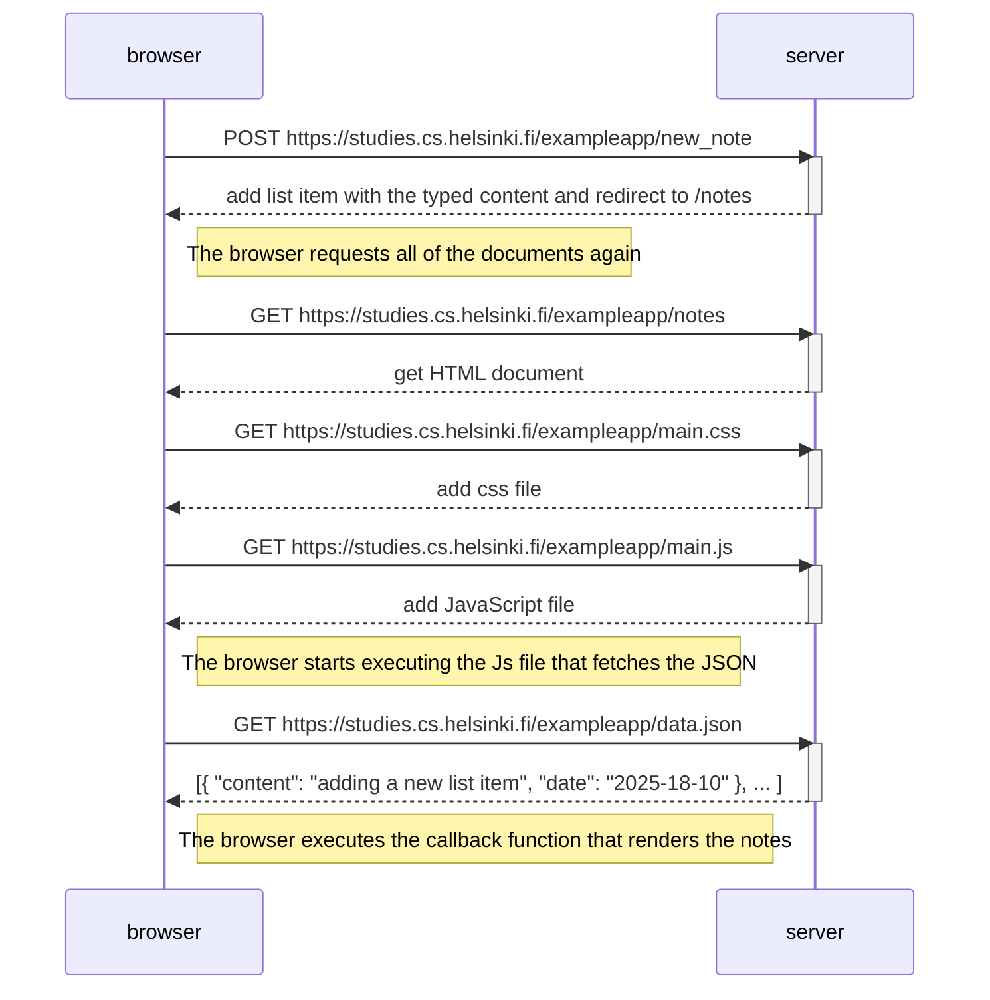

```mermaid
sequenceDiagram
	participant browser
	participant server

		browser->>server: POST https://studies.cs.helsinki.fi/exampleapp/new_note
		activate server
		server-->>browser: add list item with the typed content and redirect to /notes
		deactivate server

				Note right of browser: The browser requests all of the documents again

    browser->>server: GET https://studies.cs.helsinki.fi/exampleapp/notes
    activate server
    server-->>browser: get HTML document
    deactivate server

    browser->>server: GET https://studies.cs.helsinki.fi/exampleapp/main.css
    activate server
    server-->>browser: add css file
    deactivate server

    browser->>server: GET https://studies.cs.helsinki.fi/exampleapp/main.js
    activate server
    server-->>browser: add JavaScript file
    deactivate server

				Note right of browser: The browser starts executing the Js file that fetches the JSON

    browser->>server: GET https://studies.cs.helsinki.fi/exampleapp/data.json
    activate server
    server-->>browser: [{ "content": "adding a new list item", "date": "2025-18-10" }, ... ]
    deactivate server

				Note right of browser: The browser executes the callback function that renders the notes
```

