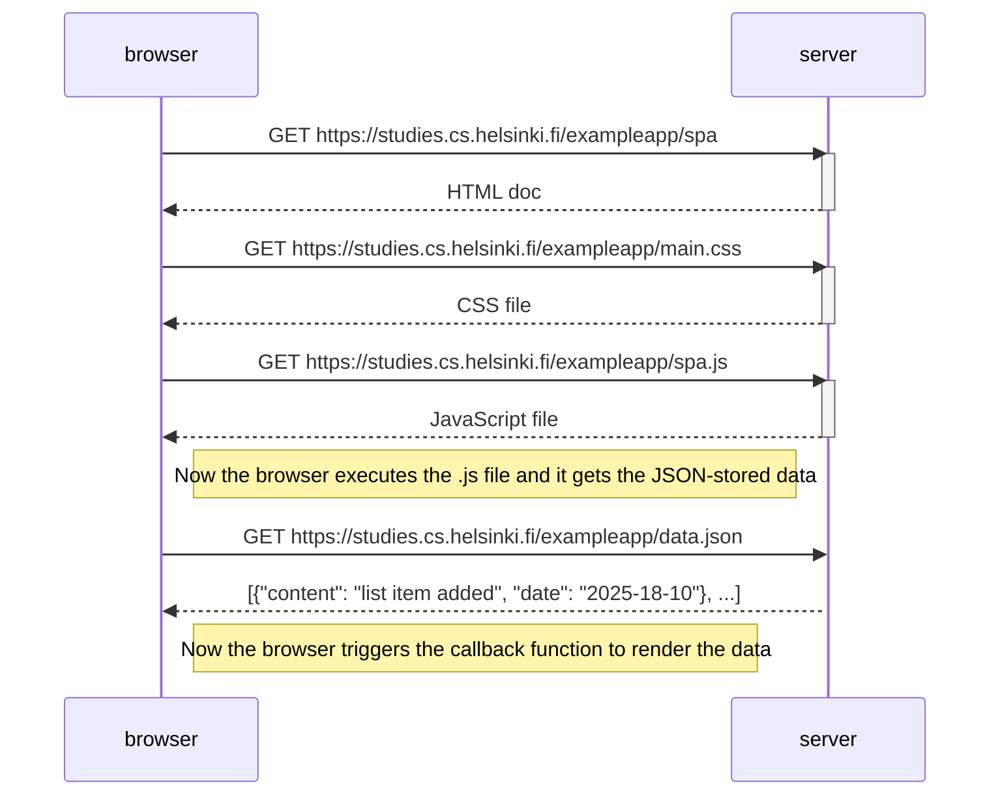

```mermaid
sequenceDiagram
  participant browser
  participant server

    browser->>server: GET https://studies.cs.helsinki.fi/exampleapp/spa
    activate server
    server-->>browser: HTML doc
    deactivate server

    browser->>server: GET https://studies.cs.helsinki.fi/exampleapp/main.css
    activate server
    server-->>browser: CSS file
    deactivate server

    browser->>server: GET https://studies.cs.helsinki.fi/exampleapp/spa.js
    activate server
    server-->>browser: JavaScript file
    deactivate server

        Note right of browser: Now the browser executes the .js file and it gets the JSON-stored data

    browser->>server: GET https://studies.cs.helsinki.fi/exampleapp/data.json
    activate server
    server-->>browser: [{"content": "list item added", "date": "2025-18-10"}, ...]

        Note right of browser: Now the browser triggers the callback function to render the data
```
